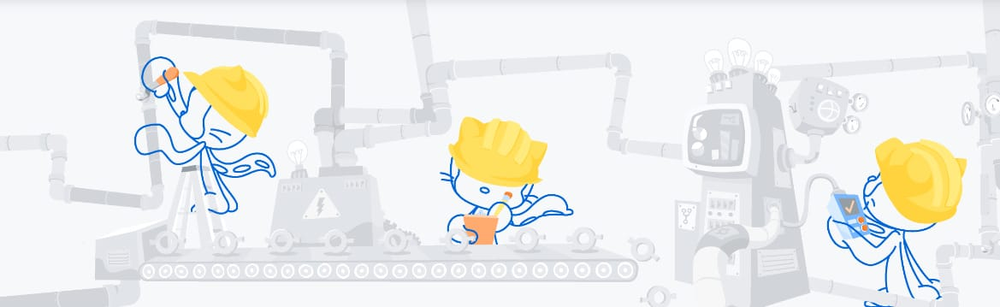

## <h1 align="center"> Hi there 👋, I'm Sameer </h1>


## 🤷‍♂️ About Me:
- 🔭 I’m currently working on open-source
- 🌱 I’m currently learning how to code
- 👯 I’m looking to collaborate on open-source projects
- 🤔 I’m looking for help with web-devlopment, machine learning based projects
- 📫 How to reach me: sameerdesai.dev@outlook.com
- 😄 Pronouns: He/Him
- ⚡ Fun fact: I love exploring technology and learning new things.
 <!--- 💬 Ask me about ...-->
 
```javascript
const sameer = {
  pronouns: ["He", "Him"], 
  code: ["Python", "Javascript", "C++"],
  askMeAbout: ["Web Development", "Machine Learning"],
  technologies: {
    frontEnd: {
      js: ["React", "Next.js"],
      css: ["Tailwind", "Bootstrap"],
    },
    backEnd: {
      js: ["Node", "Express"],
      python: ["Django"],
    },
    databases: ["MySQL"],
  },
  currentFocus: "Trying to make great things possible with code",
};

```

<!--

<p align="center">
  <a href="">Portfolios</a> - - 
  <a href="">Twitter</a> -
  <a href="https://topmate.io/sanjaykv/">Contact me.</a> 
</p>)


<h1 align="center" style="font-size: 2em; color: #333;">Sameer's Profile</h1>

-->
<details>
  <summary style="font-size: 16px; font-weight: bold; cursor: pointer;">
  <h2>
     
     GitHub Stats
  </h2>    
  </summary>
  <div align="center">
  <table>
    <tr>
      <td align="center">
        <a href="https://quira.sh?utm_source=widgets&utm_campaign=Sameerdesai">
          
        </a>
      </td>
      <td align="center">
        <a href="https://quira.sh?utm_source=widgets&utm_campaign=Sameerdesai">
          
        </a>
      </td>
      <td align="center">
        
      </td>
    </tr>
  </table>
</div> 
</details>

<details>
  <summary style="font-size: 16px; font-weight: bold; cursor: pointer;">
    <h2>
      🎖️ Badges
    </h2>
  </summary>
  <h1>GSSOC(24) Badges 🪶</h1>
  <table align="center">
    <tr>
      <td>
        
      </td>
      <td>
        
      </td>
      <td>
        
      </td>
      <td>
        
      </td>
      <td>
        
      </td>
      <td>
        
      </td>
      <td>
        
      </td>
    </tr>
  </table>

  <h1>Hacktoberfest'24 Badges</h1>
  <a href="https://holopin.io/@sameeratweb">
    
  </a>
</details>





